# 🏦 Bank Customer Churn Intelligence Dashboard


> An end-to-end machine learning + business intelligence project that predicts 
> bank customer churn and visualizes actionable insights through an interactive 
> Power BI dashboard.

---

## 📊 Dashboard Preview

### Page 1 — Executive Summary
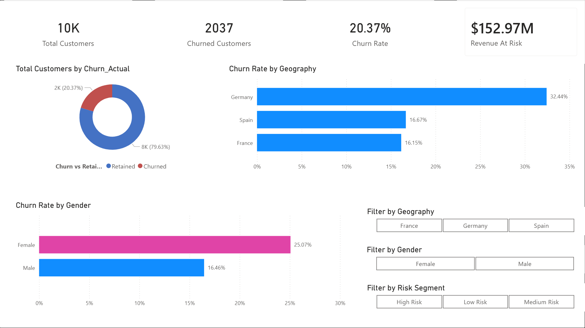

### Page 2 — At-Risk Customers
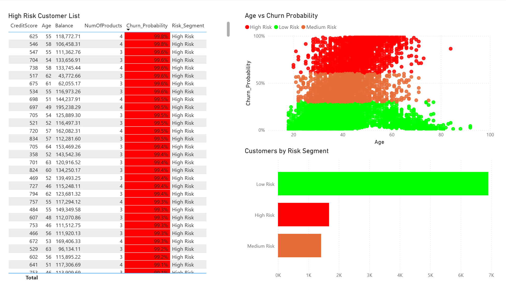

### Page 3 — Churn Drivers
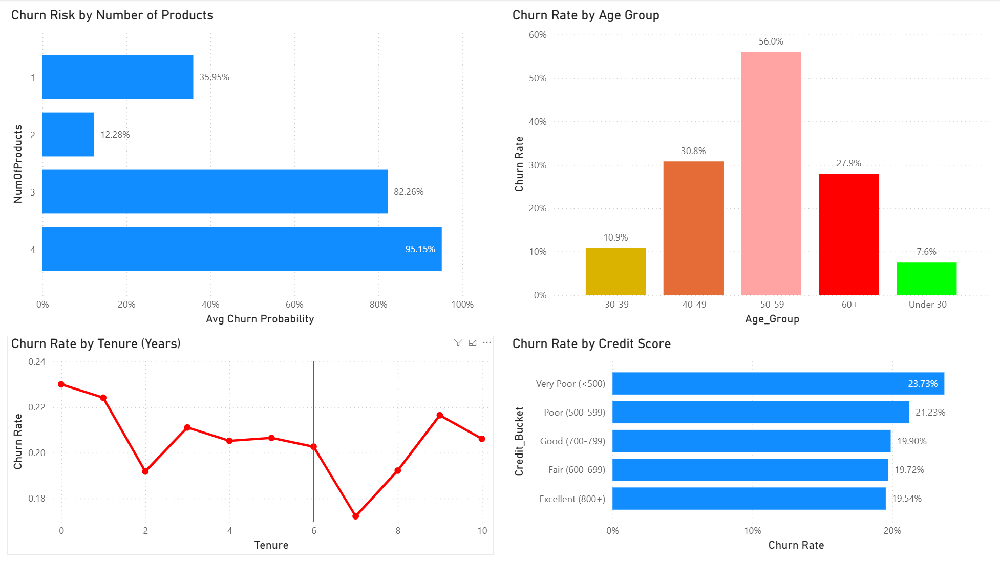

### Page 4 — Revenue Impact
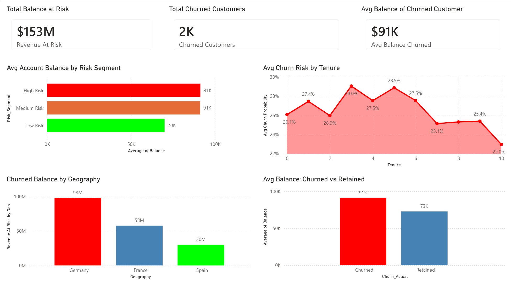

---

## 🎯 Business Problem

A European bank is losing customers at a rate of ~20%, representing over 
**$152M in deposits at risk**. This project identifies:
- Which customers are most likely to churn
- What factors drive churn behavior
- The financial impact of customer loss
- Actionable segments for retention campaigns

---

## 📊 ML Analysis

### Churn Distribution
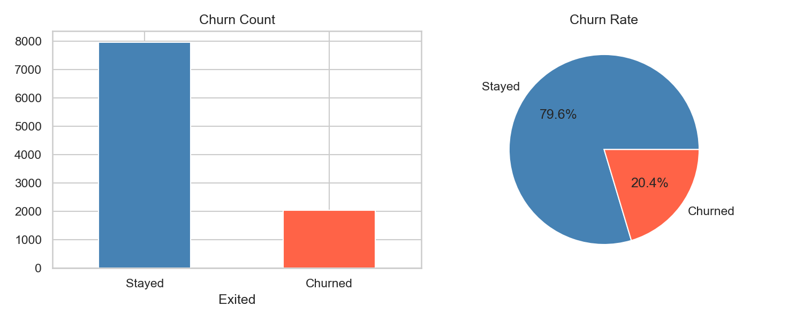

### Churn by Geography & Gender
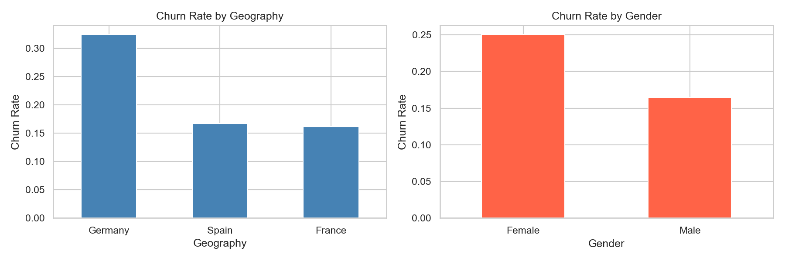

### Feature Distributions
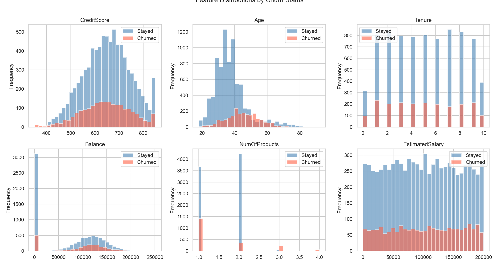

### Correlation Heatmap
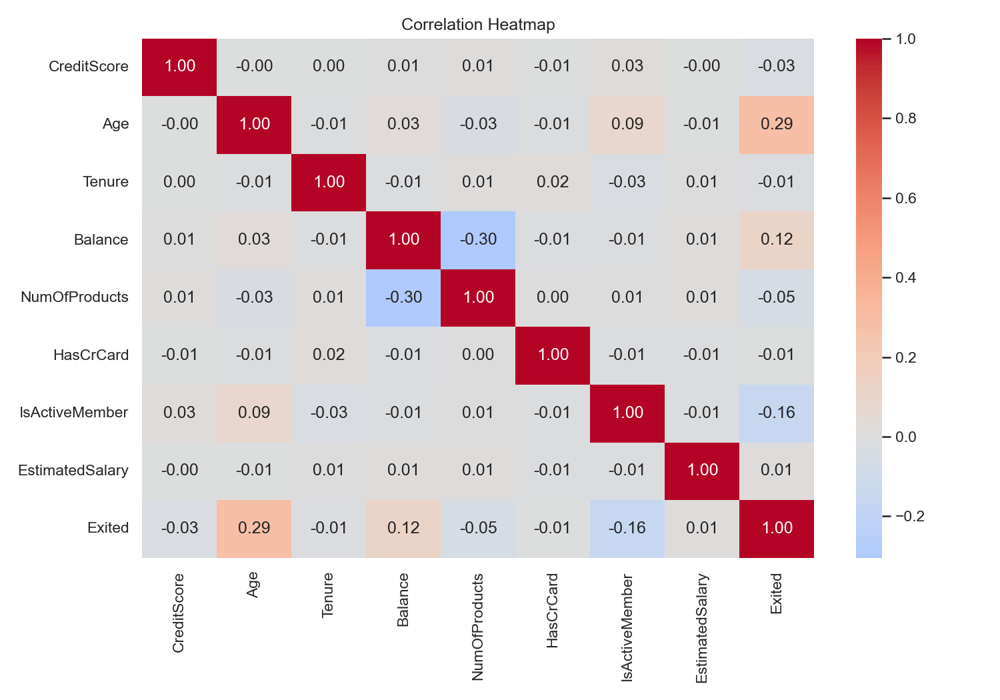

---

## 🤖 Model Evaluation

### ROC Curve — Random Forest vs XGBoost
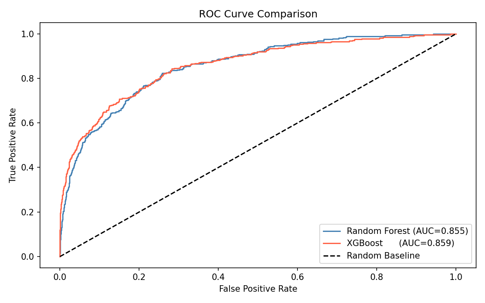

### Confusion Matrix
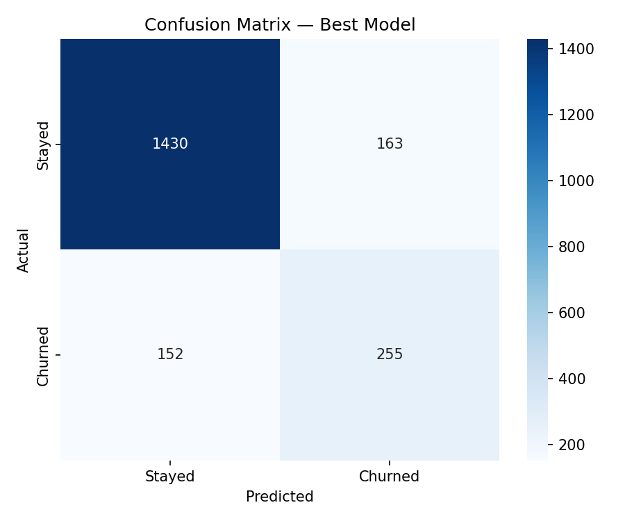

### SHAP Feature Importance
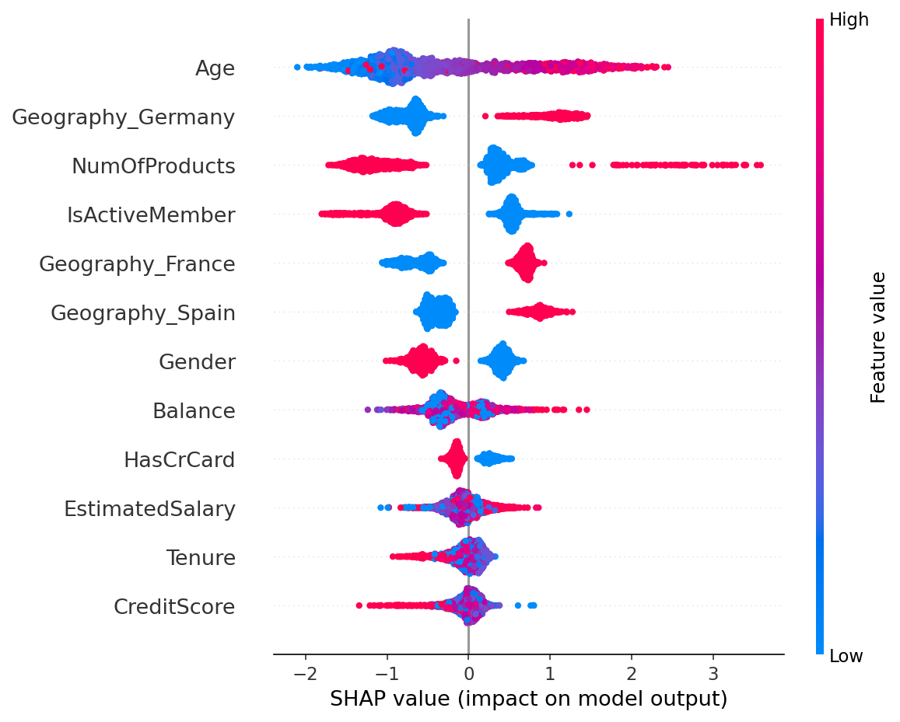

---

## 🛠️ Tech Stack

| Tool | Purpose |
|---|---|
| Python | Data preprocessing & ML modeling |
| Pandas / NumPy | Data manipulation |
| Scikit-learn | Preprocessing, train/test split |
| SMOTE | Class imbalance handling |
| XGBoost | Churn prediction model |
| SHAP | Model explainability |
| Power BI | Interactive dashboard |

---

## 📁 Project Structure
```
bank-churn-dashboard/
│
├── data/
│   ├── Churn_Modelling.csv       # Raw dataset
│   ├── churn_cleaned.csv         # After EDA & cleaning
│   ├── powerbi_export.csv        # ML outputs for Power BI
│   └── feature_names.csv         # Feature list
│
├── ml_model/
│   ├── 01_EDA.ipynb              # Exploratory analysis
│   ├── 02_Preprocessing.ipynb    # Encoding, SMOTE, scaling
│   └── 03_Model_Training.ipynb   # XGBoost training & export
│
├── powerbi/
│   └── churn_dashboard.pbix      # Power BI dashboard file
│
├── screenshots/                  # Dashboard page screenshots
│
├── requirements.txt
└── README.md
```

---

## 🤖 ML Pipeline
```
Raw Data (10,000 rows)
    ↓
EDA & Cleaning
    ↓
Encoding (Label + One-Hot)
    ↓
Train/Test Split (80/20, stratified)
    ↓
SMOTE (balance minority class)
    ↓
StandardScaler
    ↓
XGBoost Classifier
    ↓
Evaluation (Accuracy, ROC-AUC, Confusion Matrix)
    ↓
SHAP Feature Importance
    ↓
Export predictions + risk segments → Power BI
```

---

## 📈 Model Performance

| Model | Accuracy | ROC-AUC |
|---|---|---|
| Random Forest | 82.50% | 0.8549 |
| XGBoost ✅ (Selected) | 84.25% | 0.8588 |

**XGBoost — Churn Class Performance:**

| Metric | Score |
|---|---|
| Precision | 61% |
| Recall | 63% |
| F1-Score | 62% |

---

## 💡 Key Insights

- 🔢 Customers with **3-4 products** are the strongest churn predictor
- 👴 Customers aged **40-50** churn significantly more than other age groups  
- 🇩🇪 **Germany** has disproportionately high churn risk vs France & Spain
- 💰 **Account balance** is a top 4 churn driver — high balance customers leave more
- ⚠️ **1,677 customers** are currently High Risk — representing $152.97M in deposits
- 🟡 **1,417 customers** are Medium Risk and could be retained with early intervention

---

## 🎯 Risk Segment Breakdown

| Segment | Customers | Action |
|---|---|---|
| 🟢 Low Risk | 6,906 | Monitor only |
| 🟡 Medium Risk | 1,417 | Proactive outreach |
| 🔴 High Risk | 1,677 | Immediate retention campaign |

---

## 🚀 How to Run

### 1 — Clone the repo
```bash
git clone https://github.com/SH-Shad/bank-churn-dashboard.git
cd bank-churn-dashboard
```

### 2 — Install dependencies
```bash
python -m venv venv
source venv/bin/activate
pip install -r requirements.txt
```

### 3 — Run notebooks in order
```
ml_model/01_EDA.ipynb
ml_model/02_Preprocessing.ipynb
ml_model/03_Model_Training.ipynb
```

### 4 — Open the dashboard
- Download **Power BI Desktop** (free)
- Open `powerbi/churn_dashboard.pbix`

---

## 📦 Requirements
```
pandas
numpy
matplotlib
seaborn
scikit-learn
imbalanced-learn
xgboost
shap
jupyter
```

---

## 👤 Author

**Md Sajid Hossain Sad**  
Information Systems Student @ University of Texas at Arlington  
[LinkedIn](https://www.linkedin.com/in/md-sajid-hossain-sad/) | 
[GitHub](https://github.com/SH-Shad)
